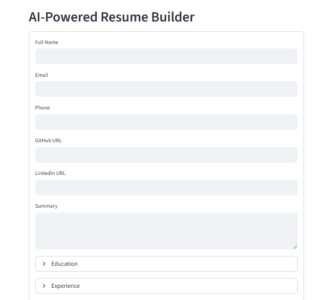
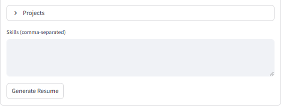
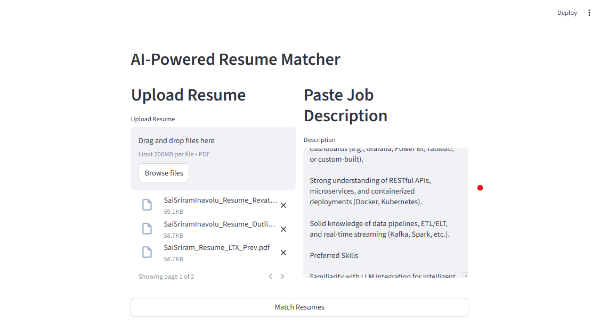
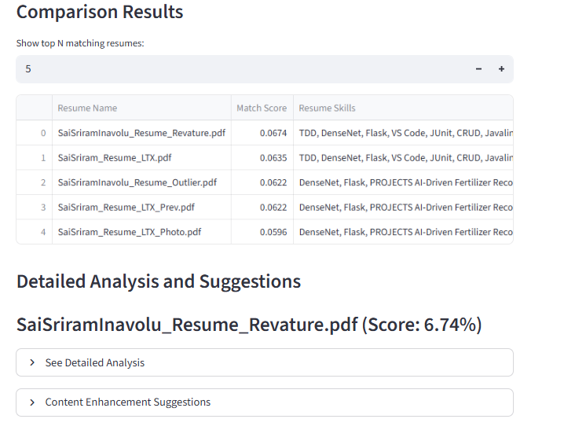
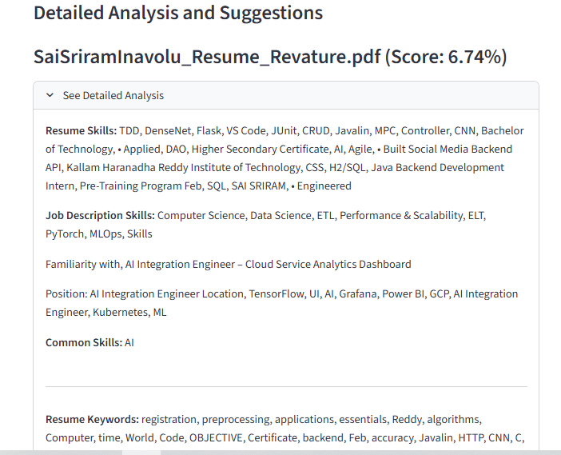
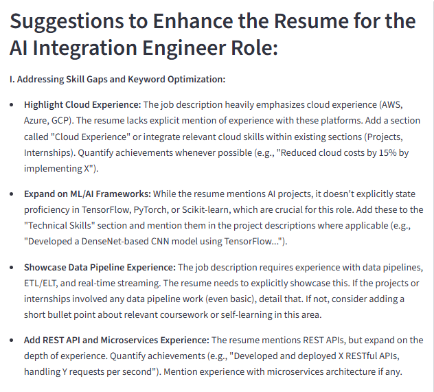
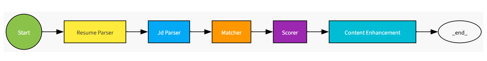
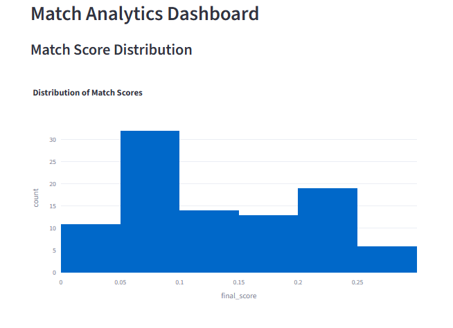
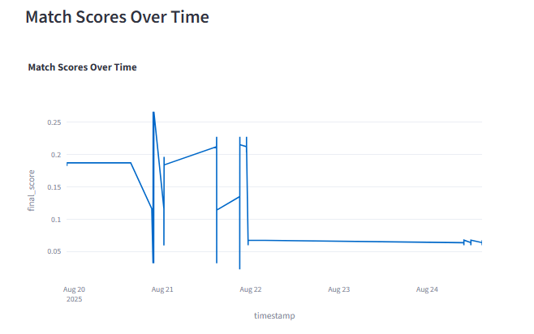
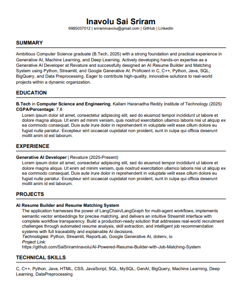

# AI-Powered Resume Builder with Job Matching System

This project is a sophisticated, AI-driven web application designed to streamline the resume creation and job matching process. It empowers users to build professional, ATS-friendly resumes and intelligently matches them against job descriptions using advanced semantic search and scoring algorithms.

## Project Description

This application leverages a powerful stack of modern AI and web development technologies to provide a seamless and intuitive user experience. At its core, it uses a multi-agent system built with LangChain and LangGraph to orchestrate the complex workflows of resume analysis, job description parsing, and semantic matching. The frontend is a user-friendly Streamlit interface that allows for easy interaction and provides complete transparency into the matching process.

The goal of this project is to provide a production-ready solution that addresses real-world recruitment challenges. It automates the tedious tasks of resume screening and analysis, providing both job seekers and recruiters with a powerful tool to find the perfect match.

## Features

### Core Features

-   **AI-Powered Resume Builder**: Create professional resumes from scratch by simply filling out a form. The app can even use AI to generate a compelling professional summary for you.
-   **Intelligent Job Matching**: Upload one or more resumes and a job description to get an instant "match score" that tells you how well each resume fits the job.
-   **Detailed Match Analysis**: Get a detailed breakdown of which skills and keywords from your resume match the job description, helping you to tailor your resume for each application.
-   **Workflow Visualization**: See a visual representation of the entire matching process, from parsing the documents to the final scoring. This provides transparency and helps you to understand how the AI is making its decisions.
-   **Analytics Dashboard**: Track your matching history and see how your resume scores have changed over time.

### Advanced Features

-   **Semantic Search**: The app uses advanced semantic search to find matches based on the *meaning* of the text, not just keywords. This means it can find good matches even if the wording in the resume and job description is different.
-   **Content Enhancement**: Get AI-powered suggestions on how to improve your resume to better match a specific job description.
-   **Multi-Resume Comparison**: Upload multiple resumes at once to see which one is the best fit for a particular job.
-   **Explainable AI**: The workflow visualization and detailed match analysis provide a high degree of transparency, making it easy to understand how the AI is making its decisions.

## Technologies Used

-   **AI & ML Frameworks**: LangChain, LangGraph, Google Generative AI (Gemini), Sentence Transformers, spaCy
-   **Web Development**: Streamlit, Plotly, Graphviz
-   **Data Processing & Storage**: ChromaDB, Pandas, NumPy, PyPDF, ReportLab

## Screenshots

### Resume Builder





### Resume Matcher







### Workflow Visualization




### Analytics Dashboard





### Example Resume Output



## Project Structure

The project is organized into the following directories:

-   `app/`: Contains the main Streamlit application code, including the UI and the AI agent definition.
-   `core/`: Contains the core logic of the application, including modules for parsing resumes and job descriptions, matching, scoring, and generating resumes.
-   `tests/`: Contains unit tests for the core components of the application.
-   `chroma_db/`: The directory where the ChromaDB vector database is stored.
-   `main.py`: The entry point for the Streamlit application.
-   `requirements.txt`: A list of all the Python libraries needed to run the project.

## Getting Started

1.  **Clone the repository:**

    ```bash
    git clone https://github.com/your-username/AI_Resume_Builder.git
    ```

2.  **Install the dependencies:**

    ```bash
    pip install -r requirements.txt
    ```

3.  **Set up your environment variables:**

    Create a `.env` file in the root of the project and add your Google API key:

    ```
    GOOGLE_API_KEY="your-google-api-key"
    ```

4.  **Run the application:**

    ```bash
    streamlit run main.py
    ```